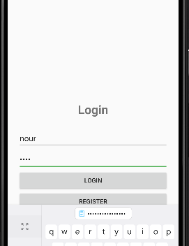
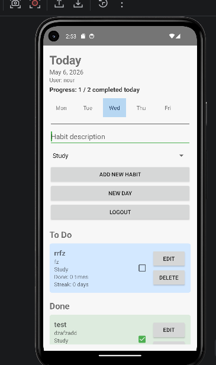

# Simple Habit Tracker

Simple Habit Tracker is an Android application written in Java. It lets users create an account, log in, and manage daily habits with a local SQLite database. The app includes per-user habit tracking, completion streaks, category labels, and a daily reset feature.

## Features

- User registration and login flow
- Persistent login session using `SharedPreferences`
- Add habits with title, description, and category
- Mark habits as done or undone
- Edit and delete habits
- Daily reset via `New Day` button
- Habit progress summary with completed count and streak
- Habits separated into `To Do` and `Done` lists
- Weekly day selector UI for context

## Tech Stack

- Java
- Android SDK
- AndroidX RecyclerView
- XML layouts
- SQLite via `SQLiteOpenHelper`
- `SharedPreferences`
- Gradle

## Project Structure

- `app/`
  - `src/main/java/com/example/simplehabittracker/`
    - `LoginActivity.java`
    - `RegisterActivity.java`
    - `MainActivity.java`
    - `DatabaseHelper.java`
    - `HabitAdapter.java`
    - `Habit.java`
  - `src/main/res/layout/`
    - `activity_login.xml`
    - `activity_register.xml`
    - `activity_main.xml`
    - `item_habit.xml`
  - `src/main/AndroidManifest.xml`
- `build.gradle`
- `settings.gradle`
- `gradle.properties`
- `gradle/wrapper/`
- `screenshots/`

## Screenshots

- `screenshots/login.png`
- `screenshots/habit-list.png`

## Database Schema

The app uses a local SQLite database in `DatabaseHelper.java`.

- Database name: `habits.db`
- Tables:
  - `users`
    - `id`
    - `username`
    - `password`
  - `habits`
    - `id`
    - `user_id`
    - `title`
    - `description`
    - `category`
    - `is_done`
    - `completed_count`
    - `streak`

## App Behavior

- `LoginActivity` verifies credentials and saves the current user session.
- `RegisterActivity` adds new users to the database.
- `MainActivity` shows habits for the logged-in user.
- Habit items track completion count, streak, and category color styling.
- `New Day` resets daily habit completion state for the current user.

## How to Run

1. Open Android Studio.
2. Select `Open an existing Android Studio project`.
3. Choose the `Habit-Tracker-App-Uni-project` folder.
4. Allow Gradle to sync and build.
5. Run the `app` module on an emulator or connected Android device.

## Notes

- The app package name is `com.example.simplehabittracker`.
- Minimum SDK is `23` and target SDK is `35`.
- The launcher activity is `LoginActivity`.

## Future Improvements

- Add stronger password validation and secure storage
- Add habit due dates or recurring schedules
- Add filtering by category or completion state
- Improve UI styling with Material components
- Add a profile screen with account details
